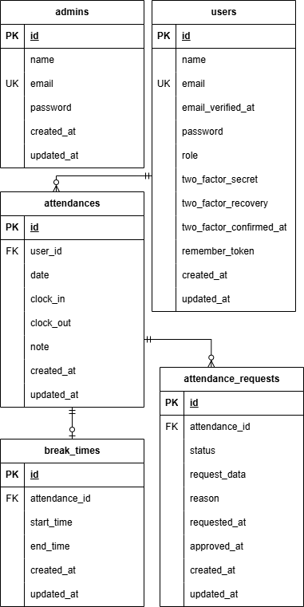

# 勤怠管理アプリケーション

---

## ① アプリ概要

本アプリは、一般ユーザーの勤怠管理、
管理者による勤怠確認・承認を行うためのWebアプリケーションです。

一般ユーザーは出退勤登録、休憩登録、勤怠修正申請が可能です。
管理者は全ユーザーの勤怠修正並びに修正申請の承認を行うことができます。

Laravel Fortify を利用し、メール認証機能を実装しています。

---

## ② 主な機能

### ■ 一般ユーザー機能
- 会員登録（メール認証付き）
- ログイン / ログアウト
- 出勤・退勤登録
- 休憩登録
- 勤怠一覧表示
- 勤怠詳細表示
- 勤怠修正申請

### ■ 管理者機能
- 管理者ログイン
- 全ユーザーの勤怠一覧表示
- 勤怠詳細確認・修正
- 勤怠修正申請の承認

---

## ③ 環境構築手順

### 1. リポジトリをクローン
git clone git@github.com:Felina24/aufgabe2.git

### 2. Dockerコンテナを起動

docker compose up -d --build

### 3. PHPコンテナに入る

docker compose exec php bash

### 4. ライブラリのインストール

composer install

### 5. 環境変数の設定

cp .env.example .env

※ .env は以下のように設定

```env
APP_NAME=Laravel
APP_ENV=local
APP_KEY=base64:xITZn17wZBbaWRwRtnq5s+DpLai/6b4XmXC8KijCxvE=
APP_DEBUG=true
APP_URL=http://localhost

DB_CONNECTION=mysql
DB_HOST=mysql
DB_PORT=3306
DB_DATABASE=laravel_db
DB_USERNAME=laravel_user
DB_PASSWORD=laravel_pass

MAIL_MAILER=smtp
MAIL_HOST=mailhog
MAIL_PORT=1025
MAIL_USERNAME=null
MAIL_PASSWORD=null
MAIL_ENCRYPTION=null
MAIL_FROM_ADDRESS=no-reply@example.com
MAIL_FROM_NAME="${APP_NAME}"
```

### 6. アプリケーションキーの生成

php artisan key:generate

### 7. マイグレーション・シーディング実行

php artisan migrate --seed

### 8. ブラウザでアクセス

- 管理者ログイン
http://localhost/admin/login

- 一般ユーザーログイン
http://localhost/login

- Mailhog  
http://localhost:8025

※ メール認証は Mailhog 上で確認します。

---

## ④ 使用技術

### バックエンド
- PHP 8.1.34
- Laravel 8.83.8
- Laravel Fortify（認証・メール認証機能）

### フロントエンド
- Blade
- CSS

### データベース
- MySQL 8.0.26

### インフラ・開発環境
- Docker（開発環境構築）
- Docker Compose（複数コンテナ管理）
- Nginx
- Mailhog
- phpMyAdmin

---

## ⑤ ログイン情報

### ■ 管理者

メールアドレス: admin@test.com  
パスワード: password  

### ■ 一般ユーザー

メールアドレス: user1@test.com  
パスワード: password123 

---

## ER図

以下は本アプリケーションのER図です。


